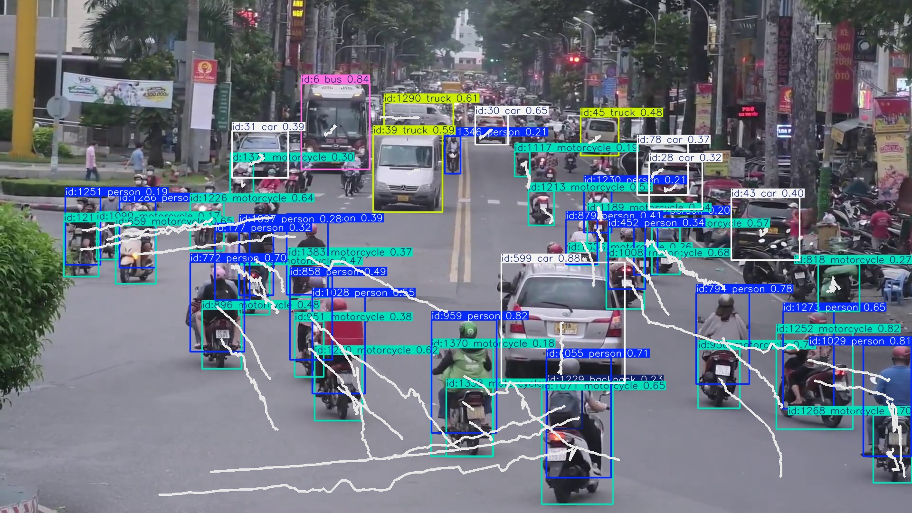
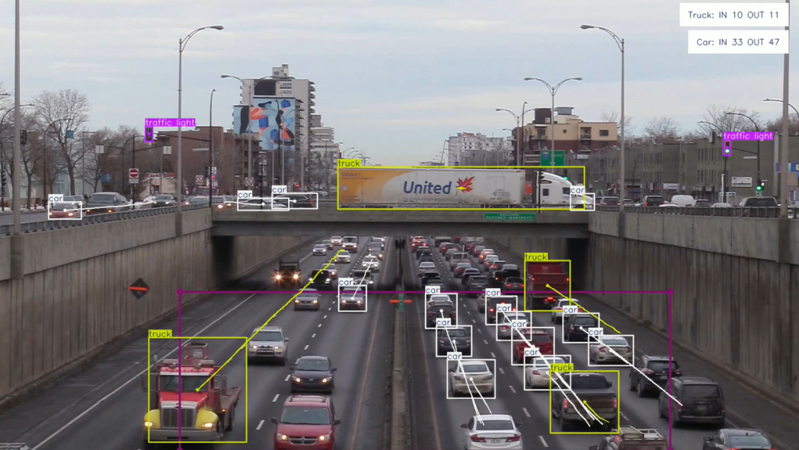
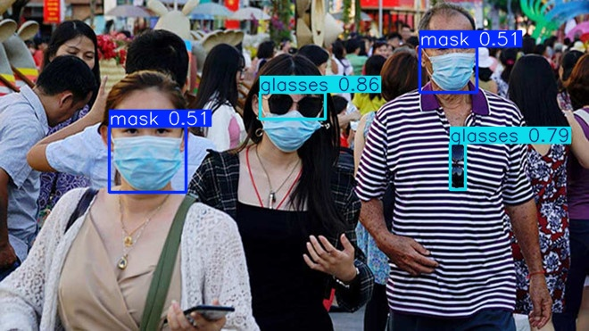
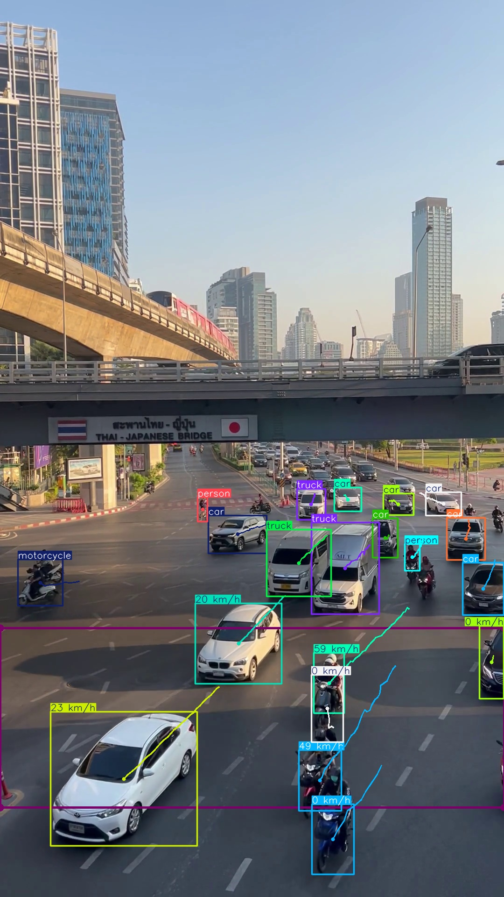

# AI-Powered Object Detection and Estimation Projects

This repository features four AI-driven projects that address different challenges in computer vision. Each implementation leverages cutting-edge models to achieve efficient and accurate results.

---

## Overview

This collection includes four specialized AI solutions:
- **Object Tracking:** Identifies and follows objects in video sequences.
- **Object Counting:** Determines the number of objects appearing in a predefined video region.
- **Open Vocabulary Detection:** Recognizes objects based on user-defined labels without predefined constraints.
- **Vehicle Speed Estimation:** Computes the velocity of moving vehicles in a video.

Each project is available in two modes:
- **Basic:** A straightforward implementation for clarity and comprehension.
- **Optimized:** Leverages batch processing for higher efficiency and scalability.

---

## Setup

1. Clone this repository:
```bash
git clone https://github.com/Nhutan410/object-detection-project.git
cd object-detection-project
```
2. Install required dependencies:
```bash
pip install -r requirement.txt
```

---

## Project Details

### 1. Object Tracking

**Overview:**  
Utilizes the YOLO model to detect and track objects across frames, ensuring smooth identification and association.

**Key Features:**
- Supports multi-object tracking.
- Assigns unique IDs to tracked objects.
- Produces annotated videos with tracking overlays.

**Model Used:**  
`yolo11l.pt`

**Execution:**

- Basic Version:
```bash
python -m src.object_tracking.simple
```

- Optimized Version:
```bash
python -m src.object_tracking.optimized
```

**Output Example:**



---

### 2. Object Counting

**Overview:**  
Monitors a designated area in a video and counts objects that enter the specified region.

**Key Features:**
- Uses polygon-based region detection.
- Outputs videos with visual count overlays.
- Handles dynamic object movement.

**Model Used:**  
`yolo11x.pt`

**Execution:**

- Basic Version:
```bash
python -m src.object_counting.simple
```

- Optimized Version:
```bash
python -m src.object_counting.optimized
```

**Output Example:**



---

### 3. Open Vocabulary Detection

**Overview:**  
Detects objects in images based on custom labels provided by the user, eliminating the need for a fixed dataset.

**Key Features:**
- Supports flexible user-defined object categories.
- Utilizes the **YOLO-World** model for detection.
- No retraining required for new object classes.

**Model Used:**  
`yolov8x-world.pt`

**Execution:**
```bash
python -m src.open_vocab_detection
```

**Output Example:**



---

### 4. Vehicle Speed Estimation

**Overview:**  
Analyzes video frames to determine vehicle speeds by tracking movement over time.

**Key Features:**
- Provides real-time or recorded video speed estimation.
- Displays speed annotations on output videos.
- Batch processing support for improved performance.

**Model Used:**  
`yolo11n.pt`

**Execution:**

- Basic Version:
```bash
python -m src.speed_estimation.simple
```

- Optimized Version:
```bash
python -m src.speed_estimation.optimized
```

**Output Example:**


